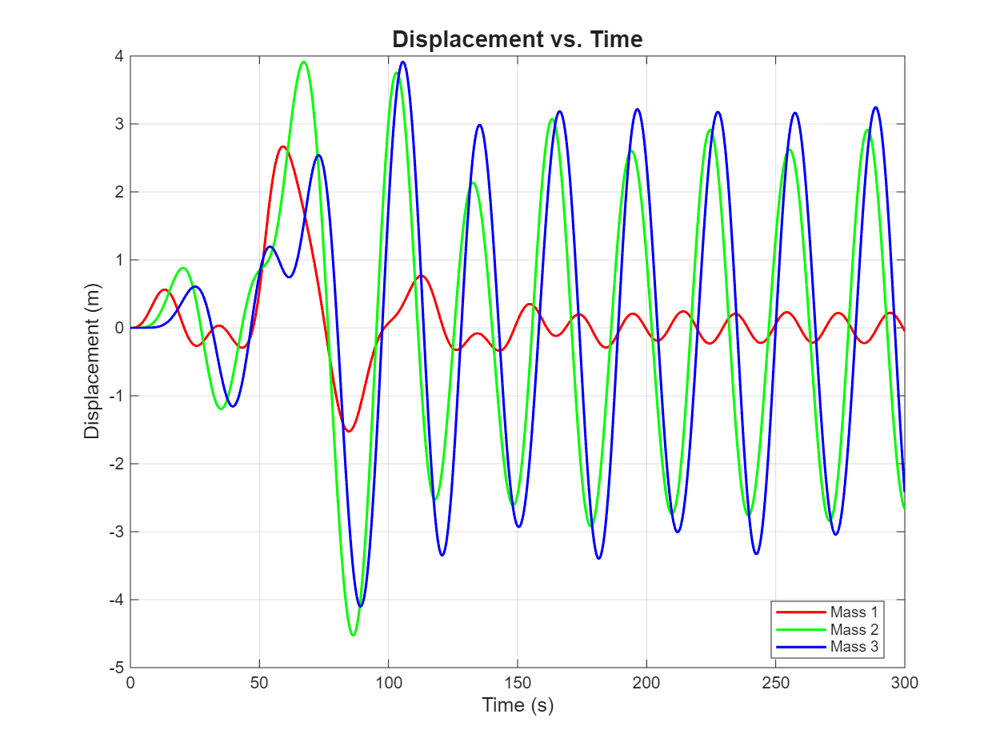
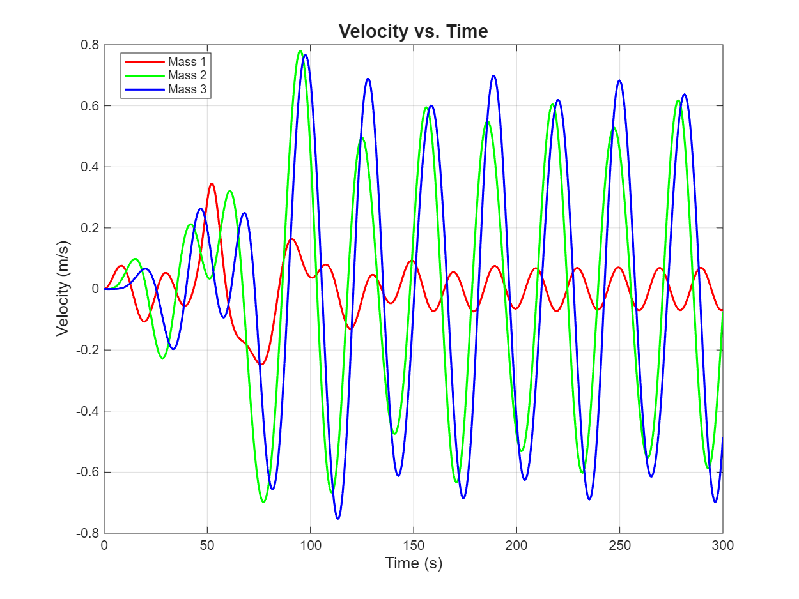
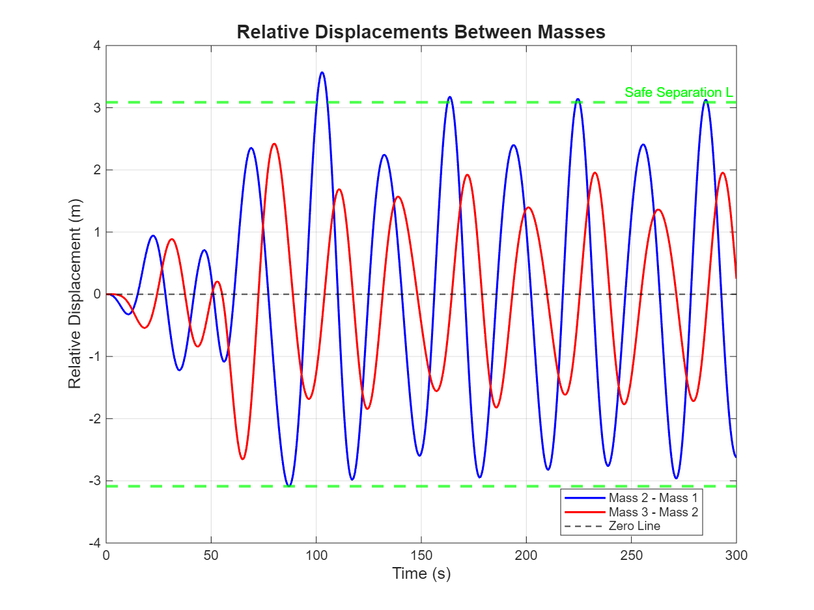

# Numerical Methods & Engineering Analysis Projects

Advanced MATLAB implementations of classical numerical methods applied to real-world mechanical, thermal, and control systems. Projects demonstrate root-finding algorithms, gradient optimization, ODE solvers, multi-body dynamics, and PID control for engineering applications.

---

## Projects

### 1. Newton-Raphson: Turbine Cold-End System Optimization

**Multi-stage iterative solver for thermal power plant performance analysis**


#### Overview

Analyzes the thermal performance of a turbine cold-end system comprising turbine exhaust, condenser, and cooling tower. The system rejects residual heat from steam turbines to maintain efficiency in power generation.

#### Challenge

Solving 6 highly coupled nonlinear equations simultaneously caused **oscillation and divergence**. Standard Newton-Raphson failed even with 100,000 iterations.

#### Solution

**Four-stage decomposition strategy:**
1. Solve polynomial equations (Eqs 1,2,6) via 3×3 Newton-Raphson → **CP, NHR, NKW**
2. Direct calculation → **CR** 
3. Scalar Newton-Raphson on Equation 3 → **CWT**
4. Algebraic solution → **WBT**

#### Key Equations

**Turbine performance curves:**
```
NHR = -45.19·CP⁴ + 420·CP³ - 1442·CP² + 2248·CP + 6666
NKW = 4883·CP⁴ - 44890·CP³ + 152600·CP² - 231500·CP + 383400
```

**Condenser-tower coupling (Eq. 3 - most nonlinear):**
```
CP = 1.6302 - 0.050095·CWT + 0.00055796·CWT²
     + 0.00032946·HL - 0.000010229·HL·CWT 
     + 0.00000016253·HL·CWT² + 0.00000042658·HL²
     - 0.000000092331·HL²·CWT + 0.000000000071265·HL²·CWT²
```

#### Jacobian Matrix (Stage 1)

```matlab
J(1,1) = -180.76*CP³ + 1260*CP² - 2884*CP + 2248
J(1,2) = -1,  J(1,3) = 0

J(2,1) = 19532*CP³ - 134670*CP² + 305200*CP - 231500
J(2,2) = 0,  J(2,3) = -1

J(3,1) = 0
J(3,2) = NKW/10⁶
J(3,3) = (NHR-3412)/10⁶
```

#### Results

**Input:** WFR = 145,000 GPM

**Converged outputs (tolerance: 10⁻¹²%):**

| Variable | Value | Description |
|----------|-------|-------------|
| **CP** | 1.447075 in Hg | Condenser pressure |
| **NHR** | 7973.97 BTU/kWh | Net heat rate |
| **NKW** | 253,335.95 kW | Net power output |
| **HL** | 1155.71×10⁶ BTU/hr | Heat load |
| **CR** | 15.94°F | Cooling range |
| **CWT** | 6.30°F | Cold water temp |
| **WBT** | 17.19°F | Wet-bulb temp |
| **AP** | -10.89°F | Tower approach |

**Convergence:** All 3 Newton-Raphson stages converged successfully

#### Technical Achievement

- **Ultra-tight tolerance** (10⁻¹²%) ensures results indistinguishable from exact values
- **Modular approach** resolved oscillation in severely nonlinear system
- **Engineering relevance**: 1% heat rate improvement = major fuel savings in power plants

---

### 2. Gradient Descent: Air Cooling System Cost Minimization

**Steepest descent optimization for industrial thermal management**


#### Problem

Multi-stage air compressors heat compressed air significantly (95°C). A three-component cooling system (precooler, refrigeration unit, cooling tower) reduces temperature to 10°C before next compression stage. **Objective:** Minimize total capital investment cost.

#### Mathematical Formulation

**Original:** 9 constraint equations  
**Reduced:** 2 constraints via algebraic substitution

```
0.0146·x₁·x₂ - 14·x₂ + 1.040·x₁ = 5092
7.68·x₃ - x₁ = 19585.253
```

**Substitution eliminates x₂ and x₃:**
```
x₂ = (5092 - 1.040·x₁) / (0.0146·x₁ - 14)
x₃ = (x₁ + 19585.253) / 7.68
```

**Final objective (unconstrained single-variable):**
```
z(x₁) = x₁ + (5092 - 1.040·x₁)/(0.0146·x₁ - 14) + (x₁ + 19585.253)/7.68
```

#### Optimization Method

**Finite-difference gradient:**
```matlab
h = 10⁻⁵
∇z ≈ [z(x₁+h) - z(x₁-h)] / (2h)
```

**Update rule (steepest descent):**
```
x₁_new = x₁ - α·∇z
```

**Parameters:**
- Initial guess: x₁ = $5,000
- Learning rate: α = 0.01
- Tolerance: 10⁻⁵
- Converged in < 1000 iterations

#### Results

| Component | Optimal Cost | Interpretation |
|-----------|--------------|----------------|
| **Refrigeration** | **$4,988.87** | Primary cost driver |
| **Precooler** | **-$1.64** | Net economic benefit (heat recovery) |
| **Cooling Tower** | **$3,199.76** | Secondary component |
| **Total System** | **$8,186.99** | **Minimized objective** |

#### Key Insight

**Negative precooler cost** indicates the mathematical model captures heat recovery economics—the precooler generates value by reducing downstream refrigeration load.

#### Why Gradient Descent?

Newton-Raphson with Lagrange multipliers finds critical points but **doesn't guarantee minimization**—could converge to maximum or saddle point. Gradient descent **guarantees descent** toward local minimum.

---

### 3. Runge-Kutta 4th Order: Compressible Flow Dynamics

**High-order ODE solver for supersonic/subsonic flow analysis in variable-area ducts**

Three physical phenomena analyzed: **area change**, **friction**, and **heat transfer**

#### Governing Equation

```
dM/dx = [M·(1 + 0.2M²)] / (1 - M²) · Φ(x,M)
```

- **Singular at M=1** (sonic condition)
- **Φ(x,M)** encodes all physics
- Domain: x ∈ [0, 5] cm
- Grid: 21 points, h = 0.25 cm

#### RK4 Implementation

```matlab
k₁ = h·f(xᵢ, Mᵢ)
k₂ = h·f(xᵢ+h/2, Mᵢ+k₁/2)
k₃ = h·f(xᵢ+h/2, Mᵢ+k₂/2)
k₄ = h·f(xᵢ+h, Mᵢ+k₃)

Mᵢ₊₁ = Mᵢ + (k₁ + 2k₂ + 2k₃ + k₄)/6
```

**Global error:** O(h⁴)

---

#### Case A: Area Change (De Laval Nozzle)


**Parameters:** α = 0.25 cm/cm, f = 0, β = 0

**Geometry:**
```
D(x) = 1.0 + 0.25x
A(x) = πD²/4
```

**Source term:**
```
Φ = -(π·α·D)/(2·A)
```

**Results:**
- **M₀ = 0.7 (subsonic):** Decreases to ~0.1 — diverging duct **decelerates** subsonic flow
- **M₀ = 1.5 (supersonic):** Increases to ~3.5 — diverging duct **accelerates** supersonic flow

**Physical principle:** Subsonic and supersonic flows respond **oppositely** to area change. This is the foundation of converging-diverging (de Laval) rocket nozzles.

---

#### Case B: Friction (Fanno Flow)


**Parameters:** α = 0, f = 0.005, β = 0

**Source term:**
```
Φ = 0.014·M²
```

**Results:**
- **M₀ = 0.7:** Increases to ~0.78 — friction **accelerates** subsonic toward M=1
- **M₀ = 1.5:** Decreases to ~1.2 — friction **decelerates** supersonic toward M=1

**Physical principle:** Friction always drives flow toward **sonic condition** (thermal choking). Both subsonic and supersonic approach M=1 asymptotically.

---

#### Case C: Heat Transfer (Rayleigh Flow)


**Parameters:** α = 0, f = 0, β = 50 J/cm, T_i = 1000 K

**Temperature variation:**
```
T(x) = 1000 + 50x
```

**Source term:**
```
Φ = (1 + 1.4M²)·50 / (2·(1000+50x))
```

**Results:**
- **M₀ = 0.5:** Increases to ~0.68 — heat addition **accelerates** subsonic
- **M₀ = 2.0:** Decreases to ~1.1 — heat addition **decelerates** supersonic

**Physical principle:** Heat addition drives flow toward M=1 (Rayleigh choking). Critical for scramjet combustor design.

---

#### Summary Table

| Effect | Subsonic Behavior | Supersonic Behavior | Mechanism |
|--------|-------------------|---------------------|-----------|
| **Area Change** | Decelerates in diverging section | Accelerates in diverging section | Geometric constraint |
| **Friction** | Accelerates toward M=1 | Decelerates toward M=1 | Entropy increase |
| **Heat Addition** | Accelerates toward M=1 | Decelerates toward M=1 | Energy addition |

**Universal trend:** All three effects push flow toward **sonic condition** (M=1) through different physical mechanisms.

#### Engineering Applications

- Rocket nozzle design (area change)
- Supersonic wind tunnel analysis (friction)
- Scramjet combustor modeling (heat transfer)
- Compressible flow in turbomachinery

---

### 4. Multi-Body Dynamics: Three-Mass Shock Damper System

**Forward Euler integration of coupled spring-damper system for vibration isolation**





#### System Configuration

**Masses:** m₁=108.9 kg, m₂=45.0 kg, m₃=54.4 kg  
**Springs:** k₁=1.9 N/m, k₂=3.4 N/m, k₃=1.8 N/m  
**Dampers:** c₁=6.5 N·s/m, c₃=4.2 N·s/m

**External forcing (applied to m₁):**
```
F₁(t) = 2·sin(2πt/20) + 8·exp(-(t-50)²/15)
        ↑                 ↑
   sinusoidal          Gaussian shock
   (20s period)        (t=50s, σ≈3.87s)
```

#### Equations of Motion

```
Mass 1: m₁·a₁ = -k₁·x₁ - c₁·v₁ + F₁(t)
Mass 2: m₂·a₂ = k₁·(x₁ - x₂)
Mass 3: m₃·a₃ = k₁·(x₂ - x₃) - k₃·x₃ - c₃·v₃
```

**Numerical integration (Forward Euler):**
```
v(i) = v(i-1) + a·Δt
x(i) = x(i-1) + v·Δt
```

**Simulation:** 300 seconds, Δt = 0.1s, 3001 time steps

#### Key Results

| Metric | Value | Description |
|--------|-------|-------------|
| **L** | 3.09 m | Minimum separation to prevent collision |
| **vmax** | 0.78 m/s | Maximum velocity (occurs in Mass 3) |
| **x1a** | 0.096 m | Mass 1 position at t=5s |
| **v1a** | 0.050 m/s | Mass 1 velocity at t=5s |
| **dmin** | -3.09 m | Min distance between M1-M2 |
| **v1mean** | 0.044 m/s | Avg velocity M1 (first 10s) |

#### Physical Insights

**Energy cascade:**
- External force F₁(t) → Mass 1 → Spring k₁ → Mass 2 → Mass 3
- Dampers c₁ and c₃ dissipate energy → system reaches steady-state after ~100s

**Key observations:**
- **Mass 3** experiences highest velocities despite no direct forcing (energy accumulation)
- **Mass 2** shows largest displacement (±4 m range)
- **Mass 1** exhibits smallest amplitude (direct damping from c₁)
- System requires **~100s** to transition from transient to periodic steady-state

#### Engineering Context

Relevant to: vehicle suspension, seismic damping, vibration isolation, multi-stage shock absorbers

---

### 5. Classical PID Control: DC Motor Speed Regulation

**Three-mode controller comparison for motor speed transition**

#### System

**DC Motor parameters:**
- Torque constant: Km = 0.114 N·m/A
- Inertia: J = 1.765×10⁻⁵ kg·m²
- Armature resistance: Ra = 11.5 Ω
- Back-EMF constant: Kb = Kt = 0.1146 V·s/rad

**Transfer function:**
```
G(s) = Km / (Ra·J·s + Kb·Kt)
```

**Feedback sensor:**
```
H = 0.00497 V·s/rad
```

#### Control Objective

**Speed transition:** -85 RPM → +85 RPM (Δω = 170 RPM)

**Step input:**
```
Δω = 170 RPM = 17.8 rad/s
u_step = H·Δω = 0.0884 V
```

#### PID Gains (Op-Amp Implementation)

**Resistor/capacitor network:**
```
Rp2=5660Ω, R1=1kΩ, Ri=1112Ω, Rd2=0.5Ω, Ci=1μF, Cd=0.1μF
```

**Computed gains:**
```
Kp = Rp2/R1 = 5.660
Ki = (Rp2/R1)·(1/(Ri·Ci)) = 5091.71 s⁻¹
Kd = (Rp2/R1)·(Rd2·Cd) = 2.830×10⁻⁴ s
```

#### Three Controllers Tested

1. **P Control:** `C(s) = Kp`
   - Fast response
   - Steady-state error remains

2. **PI Control:** `C(s) = Kp + Ki/s`
   - Eliminates steady-state error
   - Slower, potential overshoot

3. **PID Control:** `C(s) = Kp + Ki/s + Kd·s`
   - Optimal: fast settling + minimal overshoot
   - Derivative term adds damping

**Simulation:** 0.5 seconds, step size = 10⁻⁴ s

#### Performance Comparison

Each controller simulated for the same speed transition, demonstrating classical trade-offs between response speed, steady-state accuracy, and overshoot.

---

## Technical Methods

| Method | Formula | Order | Application |
|--------|---------|-------|-------------|
| **Newton-Raphson** | x_new = x - J⁻¹·F(x) | Quadratic convergence | Nonlinear systems |
| **Gradient Descent** | x_new = x - α·∇f | Linear convergence | Optimization |
| **RK4** | y_new = y + (k₁+2k₂+2k₃+k₄)/6 | O(h⁴) global | ODEs |
| **Forward Euler** | y_new = y + h·f(x,y) | O(h) global | Simple dynamics |
| **PID Control** | u = Kp·e + Ki·∫e + Kd·de/dt | Feedback control | Regulation |

---

## Repository Name Suggestion

**Recommended:**
```
Numerical-Methods-Engineering-Analysis
```

**Alternatives:**
- `Advanced-Numerical-Methods-MATLAB`
- `Engineering-Computation-Showcase`
- `Applied-Numerical-Analysis-Projects`

---

## Author

**Shafayat Alam**  
Mechanical Engineering Student  
Stony Brook University

*Showcasing advanced numerical methods and control theory applied to thermal systems, fluid dynamics, multi-body mechanics, and feedback control.*
